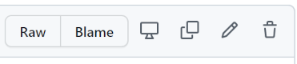

这里的路径是`/docs/docs`，所有文档都应该放到这里。

此文档说明如何在不使用Git的情况下，在Github页面上就能在线新建以及编辑文档。

## 如何新建文档

1. 点击[文档目录](https://github.com/oman009/static-wiki/tree/main/docs/docs)界面的右上角的`Add file`按钮 (*需要先登录Github*)。点击之后出现的`Create new file`(新建文件)。
2. 在随后出现的新建文件页面中可以填写文件名和和内容，也可以实时预览编写的内容。注意：文件的后缀名必须是`md`而且需要用标题做文件名。
3. 编写玩内容后需要填写一些说明，用于简单说明其内容，会显示到更新日志中方便查看。然后就可以点击`Commit new file`按钮了。

4. 然后会出现`Pull Request`界面，此界面是确认是否把刚才的修改提交给主项目，会填写一些评论方便主项目负责人查看。之后只需等待主项目的负责人确认，在确认之后就会合并到主项目中，然后你的文档就会出现网站中。*注意：如果已经有未完成的提交，那么这个界面不会出现，但是请放心你的修改已经合并到你之前的提交中了。*

5. 如果要让你的文档出现在主页时间线中需要把文件写入[timeline.yaml](https://github.com/oman009/static-wiki/blob/main/docs/timeline.yaml)中，修改文件请看下边的`如何修改文档`。

## 如何修改文档

1. 点击对应文档的内容页面中的右上角铅笔✏图标 (*需要先登录Github*)。
2. 随后流程与新建文件流程一致。

